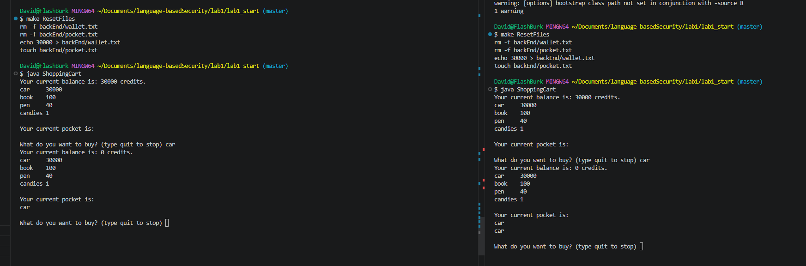
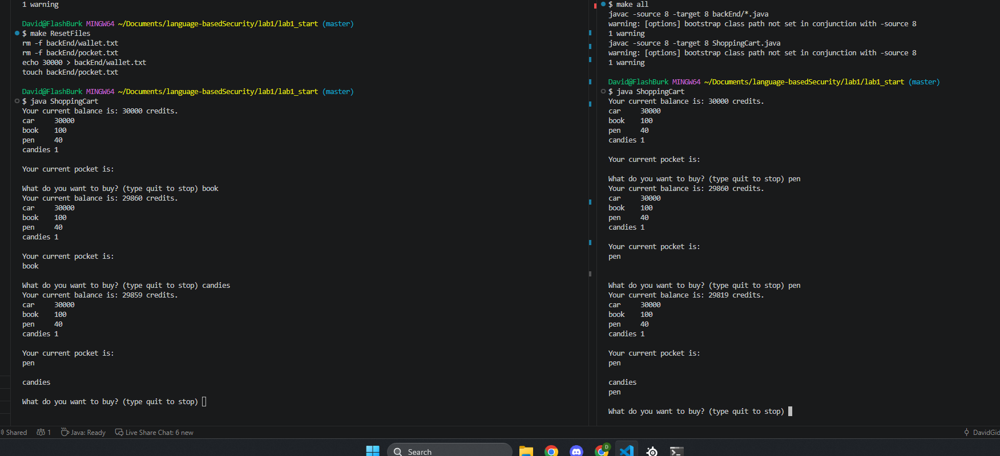
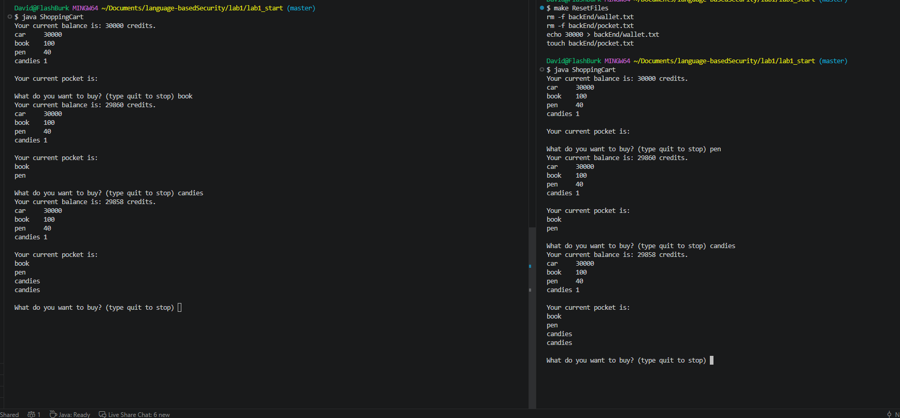
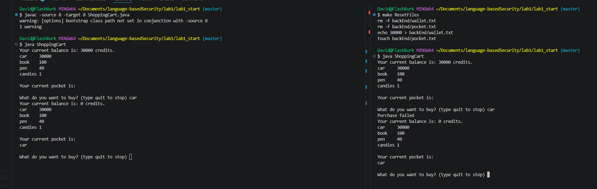

# Lab 1

## Part 0

```java
make all
java ShoppingCart
```

## Part 1

> What is the shared resource? Who is sharing it?

Wallet but more specificlly its the balance in the wallet that is being shared over mutiple instances (also the database/txt file). Each user of the program is currently sharing the same wallet.

> What is the root of the problem?

Time of check for balance is not the same as time of use. I.e. the read and write of the balance is not atomic. dna

> Explain in detail how you can attack this system.

Create multiple instances of a user, in this case multiple terminals but in real life it would be to simply log in on the same account from multiple different sources. Then all instances of the user must time their attack to be within a reasonable timeframe. This is to prevent the system from having the time to update its balance before the next instance checks their balance. 

> Provide the program output and result, explaining the interleaving to achieve them.

The first client writes car, checks balance, then sleeps. The second client writes car, checks balance (gets the same value as the first one), then sleeps. The first client writes balance 0. The second client writes balance 0.

The attack in action:


## Part 2 

> Were there other APIs or resources suffering from possible races? If so, please explain them and update the APIs to eliminate any race problems.

The getBalance method in wallet.java needed change, so that it also used locks.

The pocket addProduct/getpProduct methods in Pocket.java needed change, so it used an exclusive FileLock and getPocket() with a shared FileLock (read only). Reason is that seek and writeBytes as two seperate operations, a TOCTOU race. 

Image of the fault:


Image of the solution:


> When eliminating all race problems, it is important to not implement the protections too aggressively, as it could lead to performance hits in the real world. This is something you should consider in the lab. Why are these protections enough and at the same time not too excessive? 

We use exclusive locks on write operations, meaning no other process can access the database while we are writing. This makes addProduct and safeWithdraw atomic in a sense. This will prevent TOCTOU for the functionality of the methods. This can lead to performance hits, but is necessary for security. For the read methods getPocket and getBalance, they both used shared locks, so that many processes can read in parallel without affecting performance a lot, as long as no process is writing anything. 



